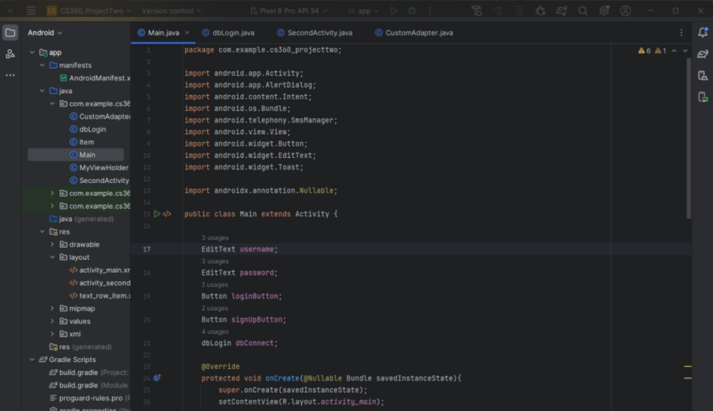

<h1 align="center">Justin Leger</h1>
<h2 align="center">Final project for SNHU Capstone</h2>

    

## CODE REVIEW

A code review serves as a quality control mechanism, promotes knowledge sharing among team members, ensures that coding standards are met, strengthens team cohesion, and contributes to a culture of continuous improvement.

Click the image to watch the code review

## Enhancement One: Software Engineering and Design
The first artifact of the portfolio adds to the Inventory app by changing the look of the login and inventory screens, adding new variables, ensuring that scrolling functionality works, and commenting on all of the code.

## Enhancement Two: Algorithms and Data Structures
The second artifact of the portfolio adds to the Inventory app by creating a sorting method to sort through items in the inventory.

## Enhancement Three: Databases
The second artifact of the portfolio adds to the Inventory app by creating a database which stores new items added to the inventory.

## Professional Self-Assessment
Motivated and detail-oriented Computer Science graduate from Southern New Hampshire University with extensive hands-on experience in programming, software development, and game design. Proficient in Python, C++, and JavaScript, with a proven track record of completing challenging coding projects both academically and independently. Skilled in collaborative problem-solving, technical documentation, and Agile methodologies. Eager to contribute innovative solutions as a professional programmer.
